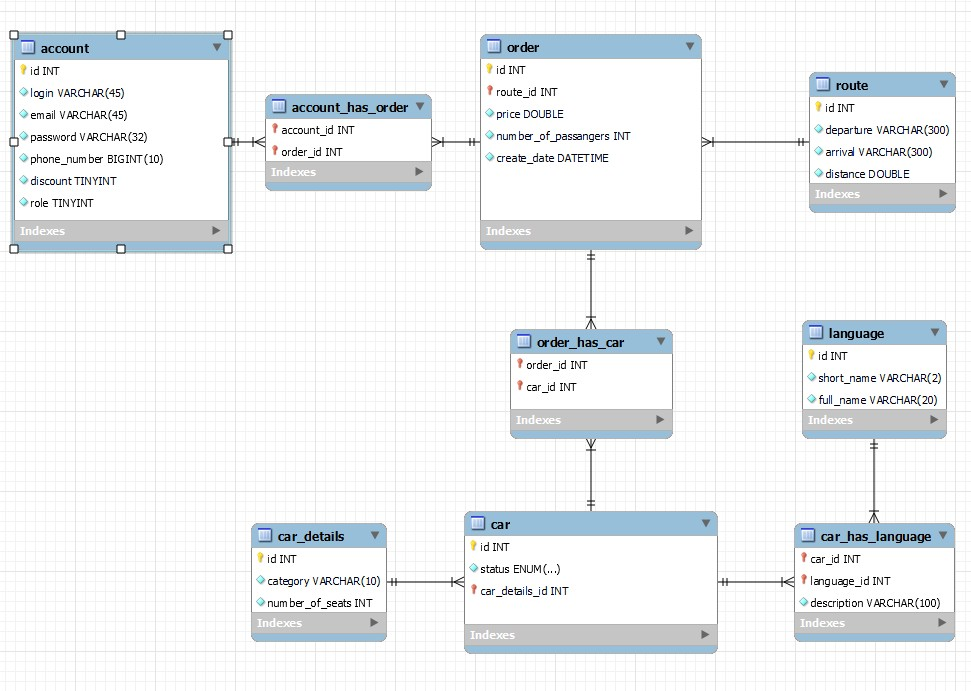

# Taxi Service
This project is a simple example of how to create a Web Project using **Java EE Servlets**, **JSP**, and **JSTL** with **MySQL**.

The implementation of the program corresponds to the **MVC pattern**.

It also supports two languages: **Ukrainian** and **English**.

## Project overview
### Components

Application  |  Version
--|--
Apache Tomcat | 9.0.52
Java EE| 8
MySQL | 8.0.26

### Database architecture

### Description of the project
There are two roles: _Client_, and _Admin_.

The _Client_ registers in the system and has the opportunity to create an order for a taxi,
specifying the address of departure, destination, number of passengers, and category of the car.

The taxi service has a fleet of drivers.
The car has the characteristics of capacity,
and category and may be available: _to_order_, _in_run_ or _inactive_ (located in the fleet without a driver).

The system calculates the cost of the trip depending on the distance and selects the available car.

If there are no suitable cars - the client can be asked to cancel the order or use an alternative solution:
- cars with the required number of seats, but a different category
- several cars of the selected category to provide the required capacity

The system supports the loyalty program - at every second ride 20% off.

The _Admin_ can view order statistics, sort them:
- on the date of order
- at the cost of the order

and filter orders:
- by clients
- on certain dates
